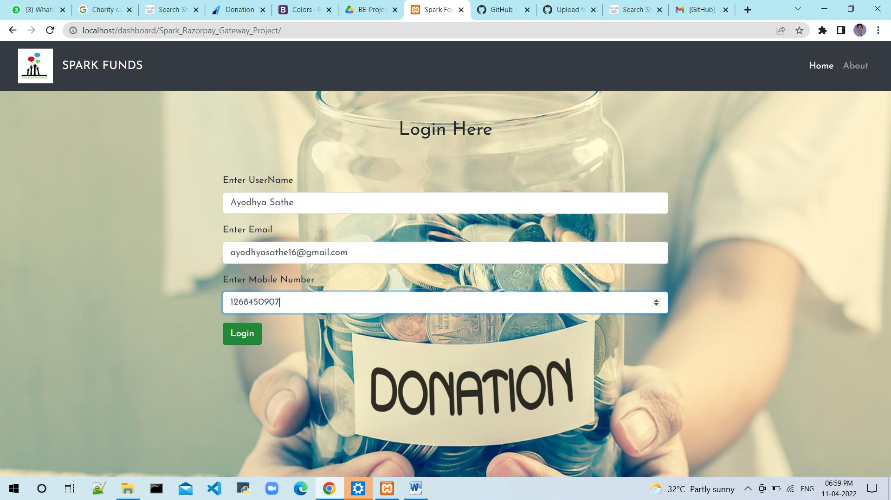
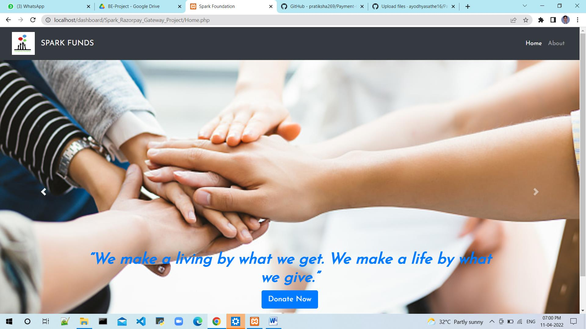
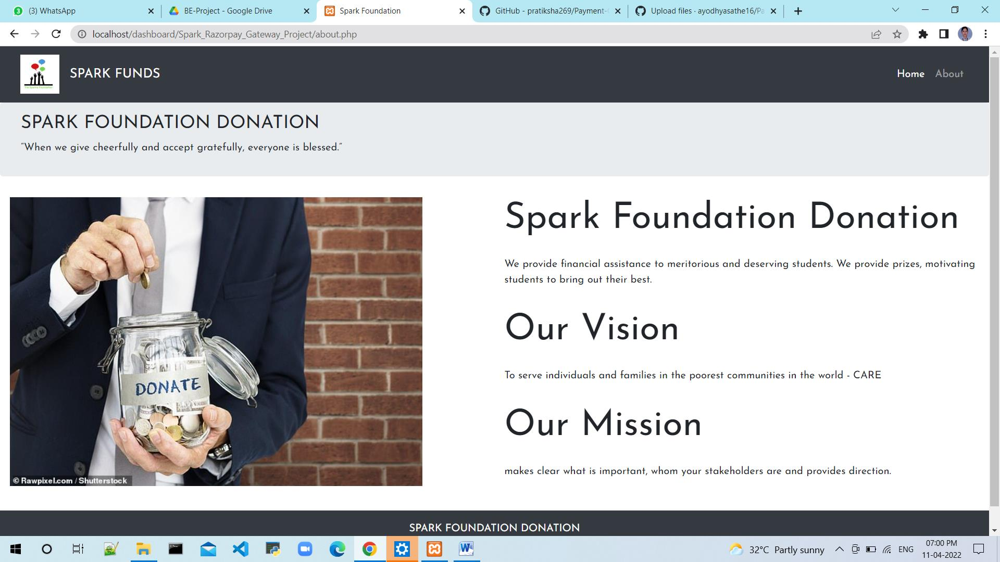
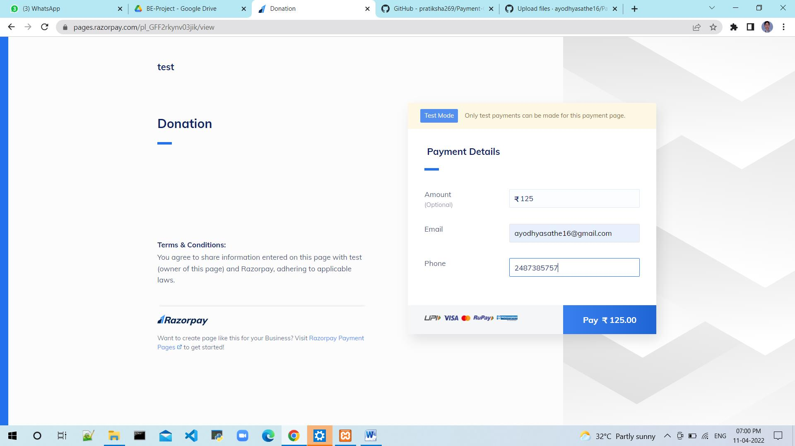
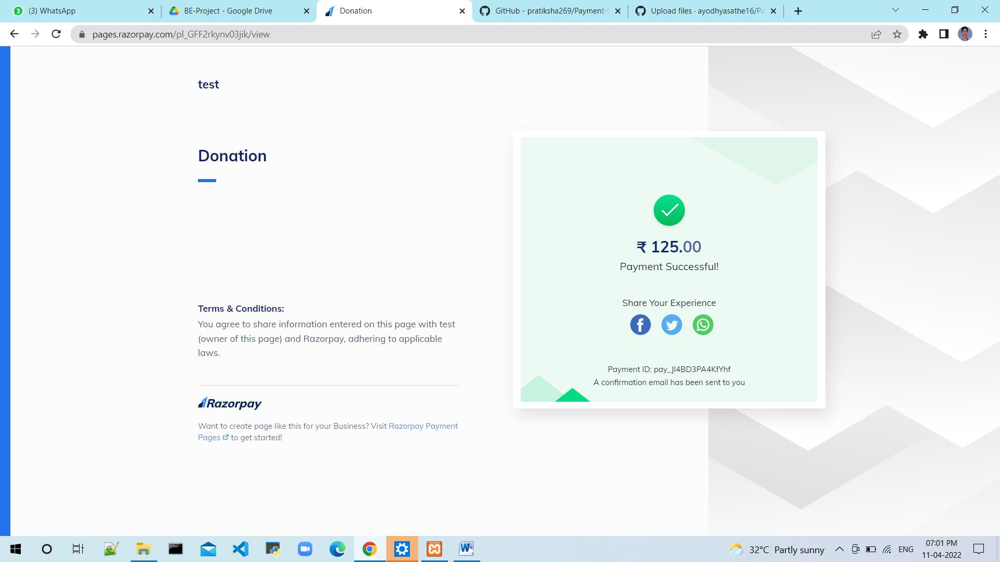
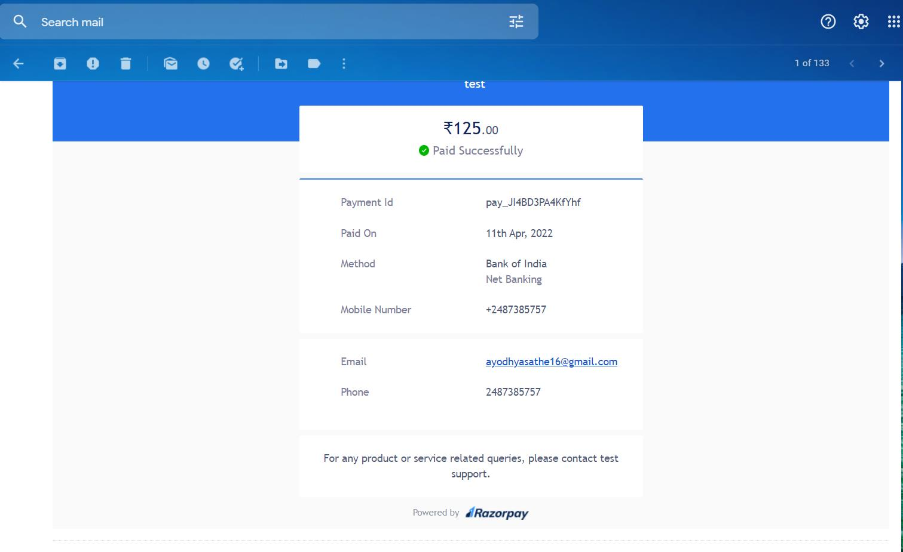

# SPARK Foundation Internship TASK#3 : Payment_Gateway_Integration_Project
<b> About Project:</b>
Create a simple button on home page. Onclicking the donate button, the user will land on the payment page where user can select the amount to be paid and the payment type.
  
<b>Payment Gateway Used: Razorpay</b>
<b>Front End :</b>
<ol>
  <li>HTML</li>
  <li>CSS</li>
  <li>Bootstrap</li>
  <li>PHP</li>
</ol> 
<b>Back End :</b> Xampp Server MYSQL
  
<h1>Login Page</h1> 

  
<h1>Home Page</h1> 

  
<h1>About Page</h1> 

  
<h1>Payment Page</h1> 

  

  
<h1>Receipt Page</h1> 

  
